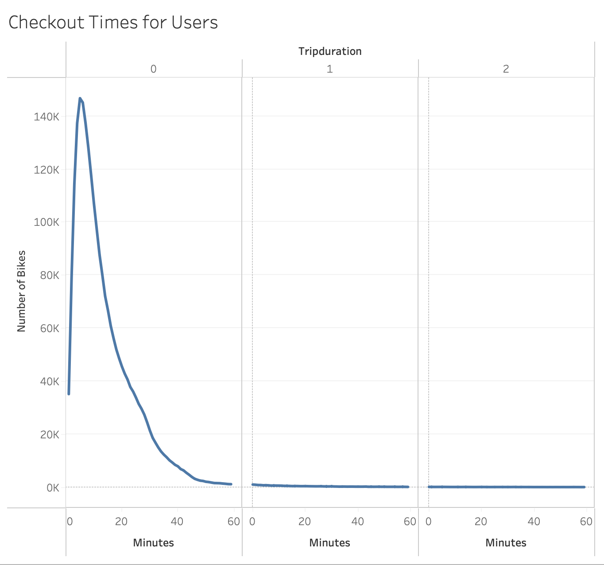
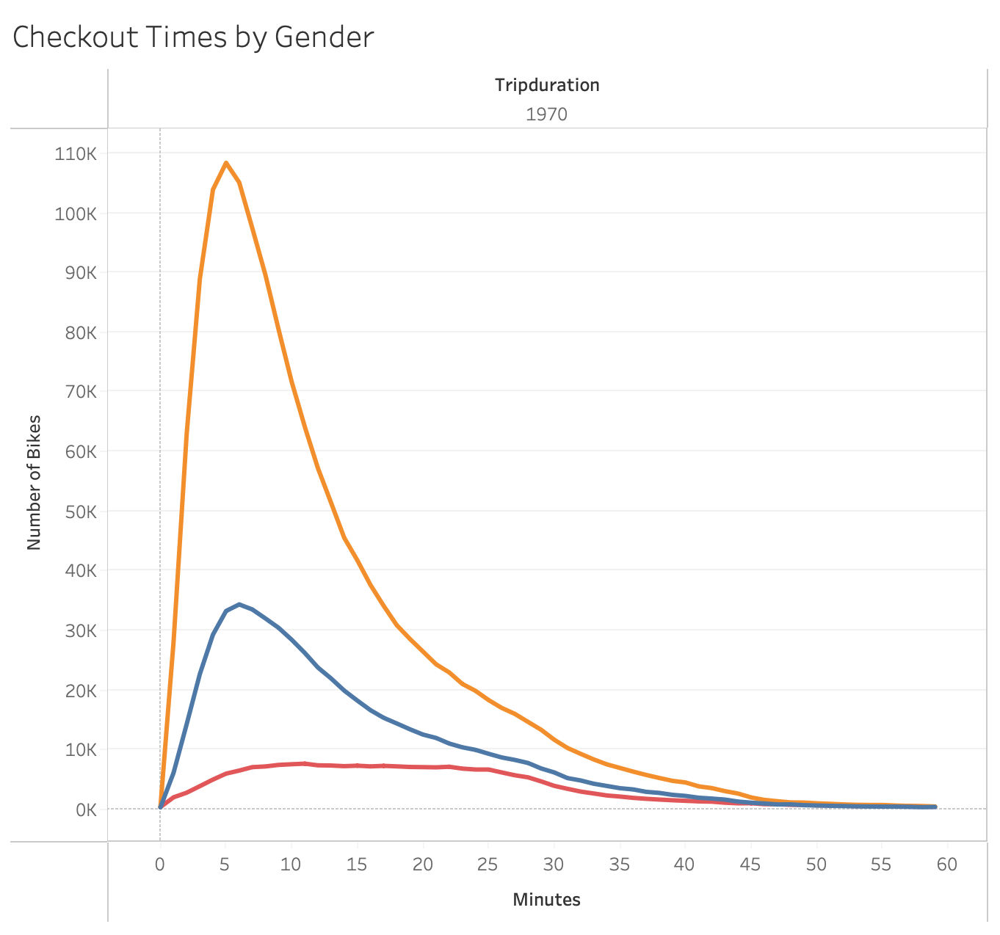
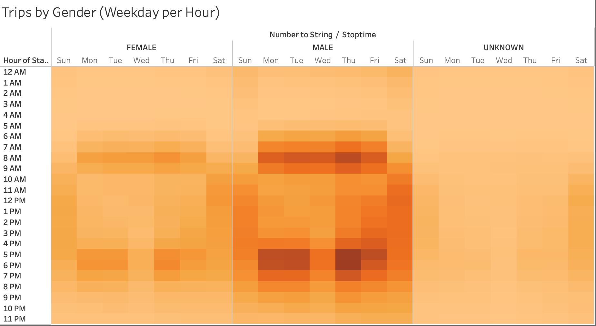
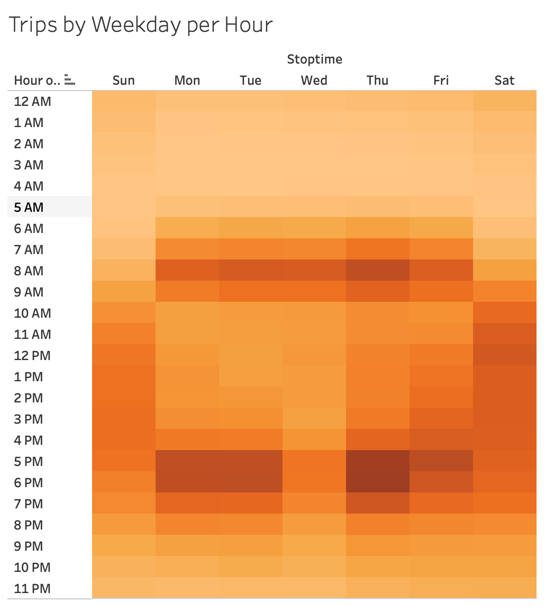
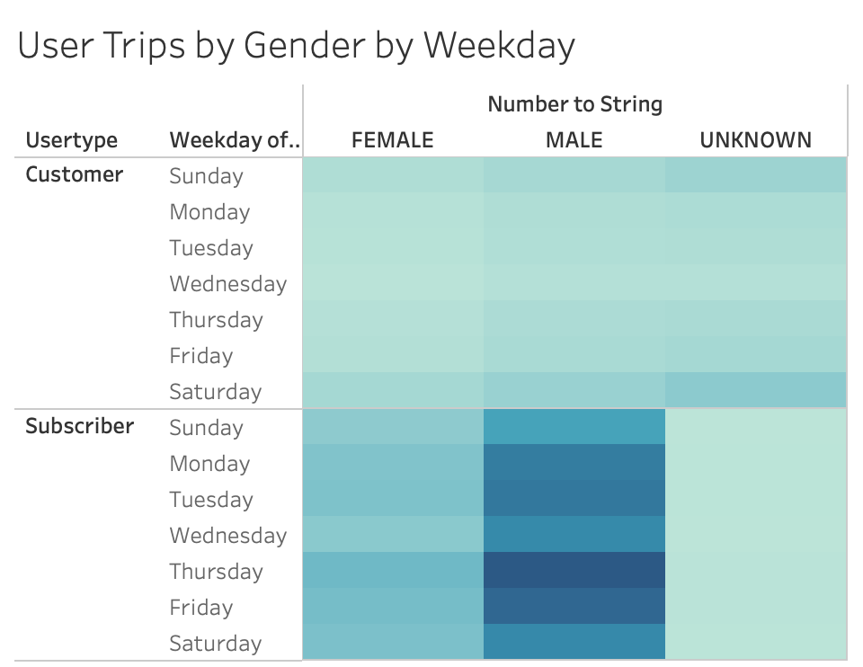
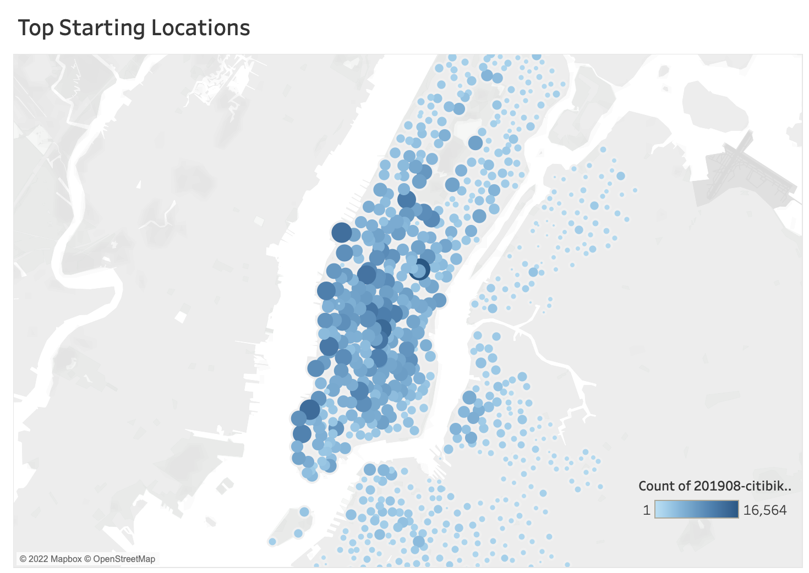
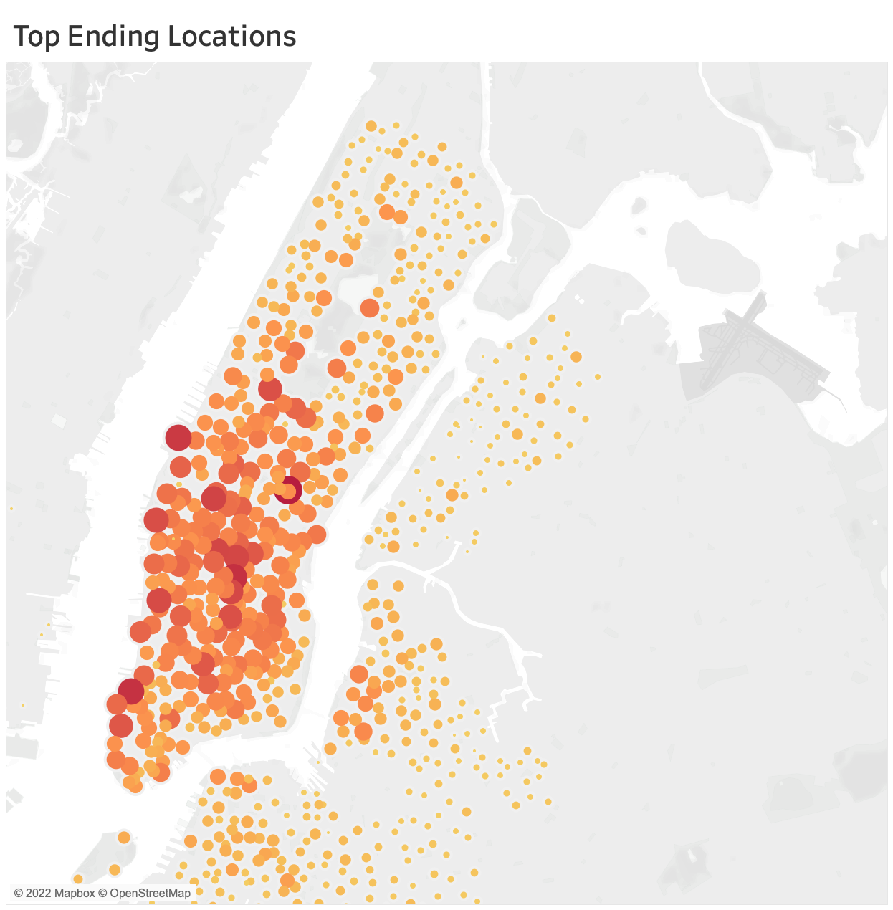

# Overview of the analysis: 

## Purpose
The purpose of this analysis is to convince investors that a bike-sharing program in Des Moines is a solid business proposal. The data used in this analysis is from Citi Bike Histories.

[Link to dashboard](https://public.tableau.com/app/profile/nicole.ardizzi/viz/NYCBikeSharingChallenge_16532728085430/CheckoutTimesforUsers)

# Results: 

### Checkout Times for Users

- Majority of the trips were under 60 minutes.

### Checkout Times by Gender

- Male riders are the main users of the bike sharing program making up two thirds of the population, with the remaining third being female and a small percentange being unknown.

### Trips by Gender (Weekday per Hour)

- Male riders are more inclined to use the bike sharing program to commute back and forth to the workplace.

### Trips by Weekday per Hour

- Most of the rides occur during the weekdays and during the rush hours of 7-9AM and 5-7PM. Data suggests the bike sharing program serves as a means of commuting back and forth to the workplace.

### User Trips by Gender by Weekday

- Thursday was the most popular day to use the bike sharing platform. Short term customers were using the bike sharing platform the most during the weekend.

### Top Starting Locations

- Usage of the bikes was significant in business areas.

### Top Starting Locations

- Usage of the bikes was significant in business areas. 

# Summary
- Usuage is significant in business areas
    - Data suggests that bikes are primarily used for commuting back and forth to the workplace.
- Subscribers are main users of the platform.
    - Subscribers provide monthly cashflow as long as there are enough bikes that are properly maintained.
- The duration of most trips were under 10 minutes.
    - Quick turnover means more people have access to bikes